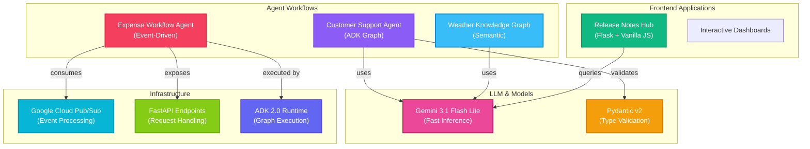

<div align="center">
  <h1>🤖 Kaggle 5-Day AI Agents with Google</h1>
  <p>Production-ready AI agents, workflows, and intelligent systems built during Kaggle's 5-Day AI Agents Intensive Course with Google. Includes ADK 2.0 workflows, Agent Runtime deployments, human-in-the-loop systems, and enterprise agentic applications.</p>

  <p align="center">
    
    
    
    
    
  </p>

  <!-- Animated Gradient Divider -->
  <div style="width: 300px; height: 4px; background: linear-gradient(90deg, #38bdf8, #8b5cf6, #f43f5e, #10b981); margin: 20px auto; border-radius: 4px;"></div>
</div>

---

## 📖 Project Overview

This repository is a comprehensive collection of **production-grade AI agent applications** developed during the Kaggle 5-Day AI Agents Intensive Course with Google. Each sub-project demonstrates different patterns in agentic AI architecture—from structured graph workflows to event-driven systems to interactive dashboards.

### 🎯 Key Highlights

- **5 Distinct AI Agent Implementations** across multiple domains
- **Google ADK 2.0** for scalable agent development
- **Human-in-the-Loop** (HITL) workflows with manual approval systems
- **Enterprise-Ready** security, validation, and telemetry
- **Multiple Architecture Patterns**: Graph-based, event-driven, dashboard-style
- **Comprehensive Testing & Evaluation** suites built into each project

---

## 📐 Repository Architecture & Structure

```
Kaggle-5-Day-AI-Agents-with-Google/
│
├── 🚚 customer-support-agent/          # ADK 2.0 Graph Workflow Agent
│   ├── Shipping logistics classification
│   ├── FAQ grounding with retrieval
│   └── Multi-node routing topology
│
├── 💸 day-4-kaggle/                    # Ambient Expense Approval Workflow
│   ├── Event-driven Pub/Sub processing
│   ├── Security checkpoints (PII/Injection detection)
│   ├── Human-in-the-loop escalation
│   └── LLM-as-judge evaluation framework
│
├── 🌦️ weather-kg/                      # Weather Knowledge Graph Agent
│   ├── Multi-source data aggregation
│   ├── Knowledge graph construction
│   └── Semantic query understanding
│
├── ⚡ shailly-event-talks-app/         # BigQuery Release Notes Hub
│   ├── Flask backend with RSS parsing
│   ├── Proxy caching architecture
│   ├── Interactive JavaScript dashboard
│   └── Dynamic CSV export & X/Twitter sharing
│
└── 📅 day-3-kaggle/                    # Additional Day 3 Workflows
    └── Extended course materials
```

---

## 🏛️ System Architecture Overview



---

## 📦 Sub-Projects & Their Domains

### 1️⃣ **🚚 Customer Support Agent** (`customer-support-agent/`)

**Domain**: Shipping & Logistics Customer Service

A high-fidelity **ADK 2.0 developer graph workflow** that classifies, routes, and resolves customer service queries for shipping logistics companies.

**Key Features**:
- ✅ Structured intent classification with Pydantic schemas
- ✅ Grounded FAQ agent (prevents hallucinations)
- ✅ Multi-node routing topology (categorize → route → respond)
- ✅ Cost-optimized static refusals for out-of-scope queries
- ✅ Enthusiastic tone with emoji-rich responses

**Tech Stack**: Python 3.11+, Google ADK 2.0, Gemini 3.1 Flash Lite, Pydantic v2

**Run Guide**:
```bash
cd customer-support-agent
python -m uv tool run --from google-agents-cli agents-cli install
python -m uv run adk web . --host 127.0.0.1 --port 8080
```

---

### 2️⃣ **💸 Expense Approval Workflow Agent** (`day-4-kaggle/`)

**Domain**: Enterprise Expense & Reimbursement Processing

An event-driven **ambient expense reviewer workflow** that processes Pub/Sub events with security checkpoints, LLM review, and human-in-the-loop escalation.

**Key Features**:
- 🛡️ **Security Checkpoints**: PII redaction + prompt injection detection
- 👤 **Human-in-the-Loop**: Manual approval for high-value expenses ($100+)
- 📊 **Routing Intelligence**: Auto-approval for clean low-value expenses
- 🧪 **LLM-as-Judge Evaluation**: Comprehensive grading framework
- 📈 **100% Pass Rate**: Routing correctness & security containment validated

**Tech Stack**: Python 3.11+, FastAPI, Google ADK 2.0, Google Pub/Sub

**Run Guide**:
```bash
cd day-4-kaggle
make install
make playground
# Trigger with: make generate-traces && make grade
```

---

### 3️⃣ **⚡ BigQuery Release Notes Hub** (`shailly-event-talks-app/`)

**Domain**: Developer-Facing Information Aggregation & Sharing

An elegant **Flask-based proxy dashboard** that aggregates, parses, filters, and shares Google Cloud BigQuery release notes with an interactive UI.

**Key Features**:
- 🔋 **Server-Side Caching**: 10-minute in-memory cache
- 🎨 **Responsive Dashboard**: Dark/light theme with glassmorphism UI
- 🐦 **X/Twitter Intent Composer**: 280-character tweet generator
- 📥 **Dynamic Export**: UTF-8 BOM CSV downloads
- 🔍 **Smart Search**: Highlight, filter, and categorize entries

**Tech Stack**: Python 3.8+, Flask 3.0.3, HTML5, CSS3, Vanilla JavaScript

**Run Guide**:
```bash
cd shailly-event-talks-app
python -m venv venv
source venv/bin/activate  # or .\venv\Scripts\Activate.ps1 on Windows
pip install -r requirements.txt
python app.py
# Visit: http://127.0.0.1:5000/
```

---

### 4️⃣ **🌦️ Weather Knowledge Graph Agent** (`weather-kg/`)

**Domain**: Weather Data & Semantic Understanding

A knowledge graph-powered agent that aggregates multi-source weather data with semantic querying capabilities.

**Tech Stack**: Python, Graph DB, Natural Language Processing

---

### 5️⃣ **📅 Day 3 Workflows** (`day-3-kaggle/`)

**Domain**: Extended Course Materials & Additional Implementations

Supplementary workflows and experiments from Day 3 of the intensive course.

---

## 🛠️ Unified Tech Stack

| Component | Technology | Version |
|-----------|-----------|---------|
| **Language** | Python | 3.8+ / 3.11+ |
| **Agent Framework** | Google ADK | 2.0+ |
| **LLM Model** | Gemini Flash Lite | 3.1 |
| **Web Framework** | Flask / FastAPI | 3.0.3+ |
| **Data Validation** | Pydantic | v2 |
| **Cloud Service** | Google Pub/Sub | Latest |
| **Frontend** | HTML5 / Vanilla JS | ES6+ |
| **Styling** | CSS3 | Modern |

---

## 🚀 Quick Start Overview

### Prerequisites
- Python 3.8+ (3.11+ recommended)
- Google Cloud credentials and API keys
- Gemini API access
- For specific projects: Docker, FastAPI, Flask

### Installation (All Projects)
```bash
# Clone repository
git clone https://github.com/shaillybhardwaj123/Kaggle-5-Day-AI-Agents-with-Google.git
cd Kaggle-5-Day-AI-Agents-with-Google

# Each sub-project has independent setup
cd <project-name>
# Follow the respective project's README.md for setup
```

### Environment Setup
```bash
# Set required credentials
export GEMINI_API_KEY="your-key-here"
export GOOGLE_GENAI_USE_ENTERPRISE="FALSE"
export PYTHONIOENCODING="utf-8"
```

---

## 📚 Learning Outcomes

Through these projects, you'll learn:

✅ **Agent Architecture Patterns**
- Graph-based workflow design
- Event-driven processing
- Human-in-the-loop systems
- Multi-agent orchestration

✅ **Prompt Engineering & LLM Integration**
- Structured output with Pydantic
- Grounding & retrieval techniques
- Safety & security in LLM applications
- Cost optimization strategies

✅ **Production Considerations**
- Error handling & telemetry
- Evaluation frameworks
- Security checkpoints
- Testing & validation

✅ **Full-Stack Development**
- Backend services (Python/FastAPI)
- Frontend dashboards (JavaScript)
- Cloud integration (Google Cloud)
- Deployment patterns

---

## 🧪 Testing & Evaluation

Each project includes comprehensive testing:

- **Unit Tests**: Core logic validation
- **Integration Tests**: End-to-end workflows
- **Evaluation Suites**: LLM-as-judge frameworks
- **Performance Benchmarks**: Latency & cost analysis

Example:
```bash
cd day-4-kaggle
make generate-traces    # Generate execution traces
make grade              # Grade traces & produce reports
```

---

## 🔒 Security & Best Practices

All projects implement enterprise-grade security:

- 🛡️ **PII Redaction**: Automatic sensitive data masking
- 🔐 **Prompt Injection Detection**: Malicious input filtering
- 📋 **Input Validation**: Pydantic schema enforcement
- 🔍 **Audit Logging**: Full execution traces
- 👤 **Human Oversight**: HITL systems for high-stakes decisions

---

## 📖 Documentation

Each sub-project includes:
- Detailed **README.md** with architecture diagrams
- **Inline code comments** for complex logic
- **Example workflows** and test cases
- **Deployment guides** and troubleshooting

---

## 🤝 Contributing

Contributions are welcome! To contribute:

1. Fork the repository
2. Create a feature branch: `git checkout -b feature/your-feature`
3. Commit changes: `git commit -m "Add feature"`
4. Push to branch: `git push origin feature/your-feature`
5. Open a Pull Request

---

## 📞 Support & Resources

- 📚 [Google ADK Documentation](https://adk.dev)
- 🤖 [Gemini API Docs](https://ai.google.dev)
- 🐍 [Python Agents Guide](https://python.langchain.com)
- 🏫 [Kaggle Learn](https://kaggle.com/learn)

---

## 📄 License

All projects in this repository are distributed under the **MIT License**. See LICENSE file for details.

---

## 👤 Author

**Shailly Bhardwaj**

- GitHub: [@shaillybhardwaj123](https://github.com/shaillybhardwaj123)
- Projects: [5-Day AI Agents with Google](https://github.com/shaillybhardwaj123)

---

## ⭐ Acknowledgments

Built during **Kaggle's 5-Day AI Agents Intensive Course with Google**. Special thanks to:
- Google Cloud & Gemini teams
- Kaggle learning platform
- Open-source community (Python, LangChain, ADK)

---

<div align="center">

**Made with ❤️ by AI Engineers**

*Pushing the boundaries of agentic AI in production*

</div>
