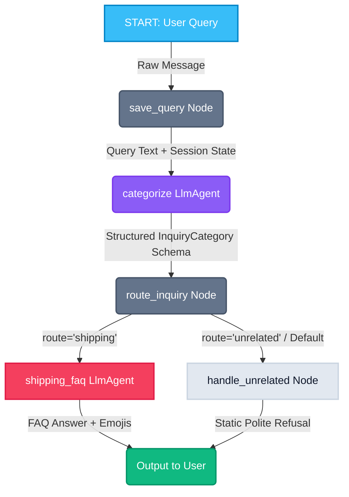

<div align="center">
  <h1>🚚 Shipping Customer Support Agent</h1>
  <p>A high-fidelity developer graph workflow agent built on Google ADK 2.0 to classify, route, and resolve customer service queries for shipping logistics.</p>

  <p align="center">
    
    
    
    
  </p>

  <!-- Animated Gradient Divider -->
  <div style="width: 250px; height: 4px; background: linear-gradient(90deg, #38bdf8, #8b5cf6, #f43f5e); margin: 20px auto; border-radius: 4px;"></div>
</div>

---

## 📖 Project Overview

This project implements a structured **Customer Support Graph Workflow Agent** for a shipping and logistics company. Built using the **Google Agent Development Kit (ADK) 2.0**, the agent determines user intent, separates shipping-related requests from general noise, and delivers responses with a playful, enthusiastic, emoji-friendly tone.

---

## 📐 Graph Architecture & Data Pipeline

The workflow utilizes an explicit node-edge topology to route queries. Below is the active data pipeline:



---

## ✨ Features

*   **Structured Intent Classification**: Uses a Pydantic `InquiryCategory` schema to enforce strict JSON classification schema validation inside the `categorize` LLM node.
*   **Grounded FAQ Agent**: The `shipping_faq` node is strictly constrained to answer queries based *only* on the shipping FAQ, preventing hallucinations.
*   **Static Polite Refusals**: Unrelated inquiries (like general trivia) bypass the LLM and route to a static refusal node, saving API token cost and minimizing latency.
*   **Enthusiastic Tone**: Generates replies packed with friendly emojis (🚚💨✨🎉) and dynamically highlights the **$50 free shipping threshold**.
*   **Static Type Checking Health**: Fully validated utilizing ADK's `EventActions` parameters to pass `ty` type checking diagnostic requirements.

---

## 📁 Repository Directory Structure

```directory
customer-support-agent/
│
├── 📂 app/                    # Main agent codebase
│   ├── 📄 __init__.py         # App initialization module
│   ├── 📄 agent.py            # Core graph, agents, and nodes logic
│   └── 📂 app_utils/          # Telemetry and typing helper routines
│
├── 📂 tests/                  # Test suites
│   ├── 📂 eval/               # ADK behavior evaluation configs and dataset files
│   ├── 📂 integration/        # Integration test endpoints
│   └── 📂 unit/               # Dummy unit test files
│
├── 📄 test_run.py             # Paced in-memory runner test script
├── 📄 pyproject.toml          # Package specifications and dependencies
├── 📄 Dockerfile              # Container building directives
├── 📄 GEMINI.md               # Context-aware AI assistant development guide
└── 📄 README.md               # Premium project documentation
```

---

## ⚡ Quick Setup & Test Guide

### 📂 Step 1: Navigate and Setup Environment
Navigate to the project directory and configure your Gemini API Key in your shell context:
```powershell
# Windows PowerShell
$env:GEMINI_API_KEY="YOUR_GEMINI_API_KEY"
$env:GOOGLE_GENAI_USE_ENTERPRISE="FALSE"
$env:PYTHONIOENCODING="utf-8"
```

### 📦 Step 2: Install Package Dependencies
Sync virtual environment and lock package references:
```bash
python -m uv tool run --from google-agents-cli agents-cli install
```

### 🚀 Step 3: Run the local test runner
Execute the automated validation suite containing both shipping and unrelated test cases:
```bash
python -m uv run python test_run.py
```

### 🌐 Step 4: Spin up the Development Playground
Launch the interactive web-based playground interface:
```bash
python -m uv run adk web . --host 127.0.0.1 --port 8080 --allow_origins "'*'" --reload_agents
```
Once started, visit: **[http://127.0.0.1:8080/dev-ui/?app=app](http://127.0.0.1:8080/dev-ui/?app=app)**

---

## 🛠️ CLI Operations

| Command | Description |
|---|---|
| `agents-cli install` | Syncs virtual environment and lock file package targets |
| `agents-cli playground` | Launch local development environment |
| `agents-cli lint` | Runs code styling validation and static typechecking |
| `agents-cli lint --fix` | Automatically formats files and resolves warnings |
| `agents-cli run "prompt"` | Run a one-off command query against a local instance |
