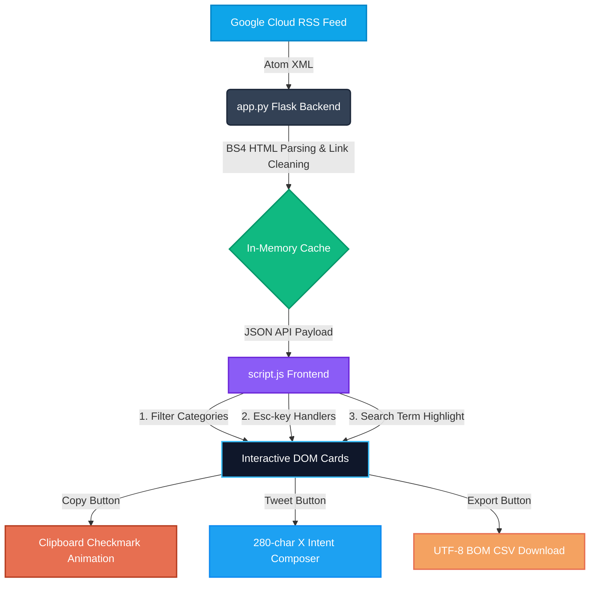
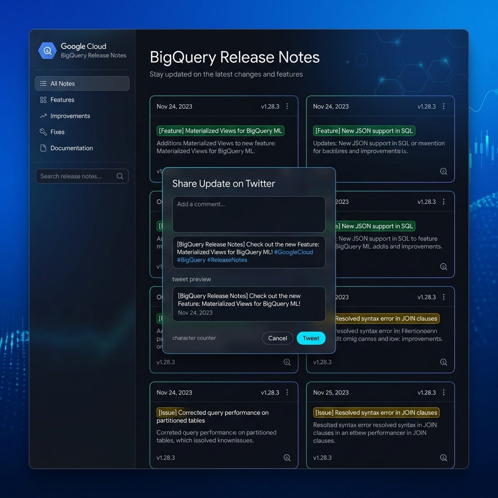

<div align="center">
  <h1>⚡ BigQuery Release Notes Hub</h1>
  <p>An elegant, high-fidelity developer dashboard to aggregate, split, filter, and share Google Cloud BigQuery Release Notes.</p>

  <p align="center">
    
    
    
    
    
    
    
  </p>

  <!-- Animated Underline -->
  <div style="width: 150px; height: 3px; background: linear-gradient(90deg, #38bdf8, #8b5cf6, #38bdf8); background-size: 200% auto; border-radius: 4px; margin: 15px auto;"></div>
  
  <p style="font-size: 1.15rem; color: #94a3b8; margin-top: 12px;">
    ⚡ <strong>Live Parser Proxy</strong> • <strong>10m Cache</strong> • <strong>Interactive X Composer</strong>
  </p>
</div>


## 📖 Executive Summary & Data Context

> ⚡ **Proxy Caching & Parsing:** The official BigQuery release notes Atom feed is structured on a per-day basis, combining various categories (Features, Issues, Changes) in a single block. This app automatically fetches the feed, proxies it to avoid CORS constraints, parses daily blocks into separate, structured items, and caches them to avoid feed query spam.

This repository implements a **Developer Dashboard and Proxy** that parses the official XML feeds from Google Cloud, restructuring raw CDATA HTML into distinct, searchable entries. By cleaning the raw links and adding real-time sharing/export capabilities, the dashboard provides developers and DevOps engineers with immediate visibility into Google Cloud platform updates.

---

## 🛠️ Tech Stack & Architecture

<div align="center">
  
| 🧠 **Flask Backend Proxy** | 🎨 **Vanilla CSS Variables** | ⚡ **Vanilla JS State** | 📥 **Dynamic Export** |
|:---:|:---:|:---:|:---:|
| Python 3, requests | Custom Theme Variables | DOM State Tracker | UTF-8 BOM CSV |
| **🔋 Server-Side Cache** | 🌓 **Theme Persist** | 📋 **Micro-Feedback** | 🐦 **X Intent Linker** |
| 10-Minute memory cache | `localStorage` Sync | Clipboard Copy Animation | 23-Character Shortener |

</div>

---

## 📐 Systems Architecture & Pipeline



---

## 🎨 User Interface Showcase

The application has been styled with a custom dark-themed console theme (and a clean, high-contrast light mode toggle) with responsive grids and glassmorphism.

<p align="center">
  
</p>

---

## 📁 Repository Directory Structure

```directory
shailly-event-talks-app/
│
├── 📂 templates/
│   └── 📄 index.html          # Semantic HTML5 layout, custom dialog markup
│
├── 📂 static/
│   ├── 🎨 style.css           # Token variables, CSS highlights, orbit transitions
│   ├── ⚡ script.js           # AJAX operations, highlights parser, clipboard transitions
│   └── 🖼️ mockup.jpg          # Application GUI mockup interface
│
├── 🐍 app.py                  # Core backend routing, proxies, BeautifulSoup parsing
├── 📄 run.ps1                 # Powershell startup automation runner
├── 📄 requirements.txt        # Python library declarations
├── 📄 README.md               # Visual documentation manual
└── ⚙️ .gitignore              # Exclusion file definitions
```

---

## ⚡ Quick Setup & Running Guide

### 📂 Step 1: Clone & Navigate
Open your CLI terminal and enter the project folder:
```bash
cd "shailly-event-talks-app"
```

### 🐍 Step 2: Set up Virtual Environment
Create and activate an isolated environment to prevent library collision:
```bash
# Create venv
python -m venv venv

# Activate venv
# On Windows PowerShell:
.\venv\Scripts\Activate.ps1
# On Windows Command Prompt (CMD):
venv\Scripts\activate.bat
# On Linux/macOS:
source venv/bin/activate
```

### 📦 Step 3: Install Packages
Install dependencies from `requirements.txt`:
```bash
pip install -r requirements.txt
```

### 🚀 Step 4: Spin up the Web Server
Launch the Flask development server:
```bash
python app.py
```
> [!TIP]
> **Windows Users**: You can run `.\run.ps1` in PowerShell. This automatically checks dependency status, installs missing packages, and spins up the server.

### 🌐 Step 5: Open in Browser
Open your browser and navigate to:
```text
http://127.0.0.1:5000/
```

---

## 🤝 Contributing & License
Distributed under the **MIT License**. Contributions, pull requests, and forks are welcome! Please open an issue to propose features or enhancements.
